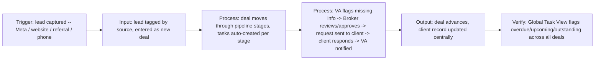

# Proposal: Pipedrive CRM Setup & Workflow Automation

## Hook
You described the VA-to-broker handoff in exact detail, so I built a working version of that specific flow before applying: a pipeline that captures leads by source, moves deals through your stages, auto-creates tasks split between broker and VA, and runs the "VA flags missing info -> broker reviews and approves -> request goes to client -> client responds -> VA resumes" mechanic end to end.

## Demo Reference
Live app: [LIVE_DEMO_URL_PENDING]

What it does:
- Captures leads tagged by source (Meta, website, referral, phone) and moves them through a 10-stage pipeline modeling your ~15-step process
- Auto-creates one task per deal stage, assigned to either Broker or VA, no manual task entry
- Global task view flags every open task as Overdue, Upcoming, or Outstanding across all deals at once
- Runs your exact approval-gate handoff live: VA flags missing info, broker reviews and approves (or sends it back), the client-facing request goes out, client responds, VA is notified and resumes -- with every handoff logged to an exportable audit trail
- 8 sample deals already spread across stages so you can see the ownership and handoff logic working, not a static mockup

Screenshots attached.

## Architecture

For the real build, this same stage/task/approval-gate logic gets built natively inside Pipedrive using pipelines, deal-stage automations, activities, and custom fields, then wired to your actual lead sources.

## Tech Stack & Timeline
Pipedrive for pipelines, custom fields, activities, and workflow automations, with Zapier or Make bridging anything Pipedrive can't do natively (Meta Lead Ads capture, SMS follow-up). Phase 1 is a 5-7 day build.

## Pricing + Phase 2
**Phase 1: $250 fixed.** Core Pipedrive pipeline built to your stages, deal-stage task automation split between broker and VA, custom fields for client/deal data, and the approval-gate handoff (VA flag -> broker review -> client request -> client response -> VA resume) fully working for one lead source end to end.

**Phase 2 (expansion):** remaining lead sources fully wired (Meta Lead Ads, website form, referral intake), SMS follow-up automation, and a monthly admin retainer ($300-500/month) to keep automations current as your process evolves.

## Demo Limitations
This is a working MVP simulating the pipeline in application state on 8 sample deals, not a live Pipedrive account -- no real Pipedrive, Meta, or SMS/email integration is connected yet. That wiring is the first deliverable of Phase 1.
