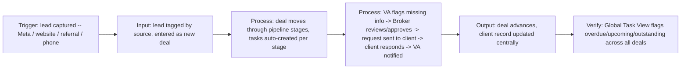

# Workflow

**Trigger:** A lead is captured from Meta/Facebook Lead Ads, the website
contact form, a referral, or a phone call/manual entry.

**Input:** Client name, contact details, loan amount, and lead source --
tagged automatically at capture so every deal carries a source from day one.

**Processing:**
- Deal moves through 10 stages: New Lead, Qualified, Application Started,
  VA Processing, Broker Review, Client Info Requested, Client Responded,
  Submitted, Approved, Declined (a simplified version of the client's
  ~15-step internal processing flow).
- Each stage auto-generates one task with a fixed owner (Broker or VA) and
  an SLA in days -- no task is created manually.
- The approval-gate mechanic runs the specific handoff from the job post:
  VA completes data entry and identifies missing information -> Broker
  reviews the request (approve, edit, or send back to VA) -> approved
  request goes to the client (drafted via template or, optionally, live
  Claude API) -> client responds -> VA is notified and resumes processing.

**Output:** The deal record (stage, owner, notes, loan amount) stays
central and current; every stage transition and handoff is written to an
auditable handoff log exportable as CSV.

**Verification:** The Global Task View aggregates every open deal's current
task and flags it Overdue, Upcoming, or Outstanding against its stage SLA,
giving a single view of everything the broker and VA owe each other on any
given day.

This demo simulates the pipeline in application state. Production version
builds these exact stages, task automations, and the approval-gate logic
natively inside Pipedrive (pipelines, activities, automations, custom
fields), wires in real Meta Lead Ads and website form integrations for lead
capture, and adds email/SMS follow-up sequences per stage.
